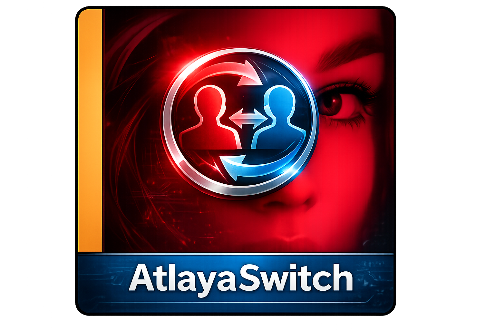

<p align="center">
  
</p>

# AtlayaSwitch

One tap on the app icon, and your phone shows only what it's supposed to show.

AtlayaSwitch is a lightweight, root-free Android app for GrapheneOS that switches instantly and without any visible menu to a predefined, deliberately unremarkable user profile — with a single tap on the app icon (or optionally an NFC ring) — for moments when a device might be briefly inspected or checked, without the action itself looking suspicious.

**Benefits:**
- No root required — uses only [Shizuku's](https://shizuku.rikka.app/) ADB shell privileges, GrapheneOS' security model stays fully intact
- No visible picker menu, no spoken codeword — switches in under a second
- Optional NFC ring trigger, works even with the screen locked or off
- The way back stays the regular, password-protected GrapheneOS profile switch — no new attack surface
- Automatically detects if it's accidentally installed in the decoy profile itself (which would give the trick away) and offers one-tap removal
- Fully offline, no cloud, no trackers

## How it works

- **MainActivity** immediately performs the switch to the saved target profile on launch (no visible UI) and then closes itself.
- **SettingsActivity** lists all existing GrapheneOS profiles, saves the selection as the target user ID, and manages NFC ring pairing. Reachable via System Settings -> Apps -> AtlayaSwitch -> App info (a "Settings" link appears there automatically, see section below) instead of a menu of its own.
- Since `Shizuku.newProcess()` is no longer publicly accessible in current Shizuku versions, the actual execution of `pm list users` / `am switch-user <id>` runs in a `UserService` process started via `Shizuku.bindUserService` with shell privileges (UID 2000). The app itself stays unprivileged, without `sharedUserId` and without root.

## Setup

1. **Install & enable Shizuku**
   - Since v1.6, **SettingsActivity** walks you through this step itself (see "Guided Shizuku setup" below) — doing it manually works the same way:
   - Install Shizuku from the Play Store / F-Droid.
   - **Important:** Developer options and "Wireless debugging" are only visible in the "Owner" profile on GrapheneOS (as on Android in general). Start Shizuku there first: enable developer options (Settings → About phone → tap the build number repeatedly if not visible yet), turn on "Wireless debugging", then tap "Start via Wireless debugging" in Shizuku (one-time pairing via pairing code, afterwards "Start" is enough). Runs entirely on the device itself, **no PC/ADB terminal needed** — the pairing code is entered directly on Shizuku's own screen. In secondary profiles ("Personal", "Away") Shizuku shows no start option there, that's not a bug.
   - Alternatively, start it from a PC via ADB: `adb shell sh /sdcard/Android/data/moe.shizuku.privileged.api/start.sh` (or the command shown in the Shizuku app).
   - After starting, the service keeps running system-wide with ADB shell privileges and is automatically recognized by AtlayaSwitch/Shizuku in the other profiles. **Without root this doesn't survive a device reboot** — Shizuku has to be started again in the "Owner" profile after every reboot, otherwise AtlayaSwitch won't react.

2. **Install AtlayaSwitch**
   - Download the current, signed **`app-release.apk`** from the [Releases page](../../releases/latest) and install it.

3. **Pick a target profile on first launch**
   - Open the app (or start `SettingsActivity` directly if no target profile is set yet).
   - Confirm the Shizuku permission when asked.
   - Tap the desired profile (e.g. "Away") -> toast "Target profile saved".

4. **From then on: app icon = one-tap switch**
   - Tapping the AtlayaSwitch icon now switches straight to the saved target profile with no further prompt.

## Security consideration: lock screen on the decoy profile

For the switch to stay a genuine single tap with no further prompt, the decoy/duress profile should have **no PIN, password or fingerprint lock** set — any lock screen there would just present its own unlock prompt after the switch. Leaving it unlocked keeps the one-tap promise, but it's a trade-off: anyone who reaches that profile also has unrestricted access to whatever is in it, with no second gate at all. Whether that trade-off makes sense depends entirely on what you put in the decoy profile and your own threat model — it's your call, not something the app decides for you.

## Note on the way back

AtlayaSwitch only switches *to* the one designated profile. The way back to other profiles (including the password prompt) still runs via the normal GrapheneOS user switch: long-press the power button -> switch user.

## CRITICAL: AtlayaSwitch must never be installed in the target profile itself

The target profile is the deliberately unremarkable decoy profile that third parties (e.g. during a check) are also meant to see. **Having AtlayaSwitch installed there would itself reveal that a hidden switching mechanism (and therefore probably further, hidden profiles) exists** — regardless of whether the app is visibly shown in the menu there or not. AtlayaSwitch is therefore deliberately meant to run only in the "Owner" (User 0) and "Personal" profiles, never in the target profile (e.g. "Away").

`adb install` without a `--user` flag installs to **all** profiles by default — so every redeploy via `adb install -r app-release.apk` also lands the app in the target profile unless it's specifically removed afterwards.

**Since v1.7, AtlayaSwitch detects and prevents this itself:** whenever a target profile is selected in **SettingsActivity**, the app automatically checks (via the privileged Shizuku UserService) whether it's installed in the chosen target profile. If so, a clearly red warning appears right under the profile list with a "Remove from target profile now" button — removes AtlayaSwitch from exactly that profile with one tap, without needing to switch there (`pm uninstall --user <id>` via the UserService). That's the recommended approach after every redeploy: just briefly open **SettingsActivity** and dismiss the warning if present.

Still possible for manual deploys:

```
adb shell pm list users
adb shell pm uninstall --user <target profile ID> com.capecter.atlayaswitch
```

Or install specifically from the start:

```
adb install --user 0  app-release.apk   # Owner
adb install --user 10 app-release.apk   # Personal (check ID via "pm list users" if needed)
```

Shizuku itself only needs to be started once via ADB (in the "Owner" profile, since only there is the wireless-debugging setting visible). The service then keeps running system-wide with shell privileges and is automatically recognized by the Shizuku app instances in other profiles as soon as a permission request (e.g. by AtlayaSwitch) runs there once.

## Reaching settings via App info

AtlayaSwitch deliberately has no menu of its own that stands out via the app icon or the app overview. All settings (target profile, NFC ring pairing) live in **SettingsActivity**, reachable via:

Android Settings -> Apps -> AtlayaSwitch -> App info -> "Settings" (appears there automatically because `SettingsActivity` declares the `android.intent.action.APPLICATION_PREFERENCES` intent).

Alternatively, start it directly: `adb shell am start -n com.capecter.atlayaswitch/.SettingsActivity`.

Target profile selection and NFC ring pairing still save immediately on tap (SharedPreferences). At the bottom of the page there are also "Back" and "Save" buttons — "Save" is the only step with a real effect on the system (sets the NFC start permission, see below), making it visible when something is actually changed on the system rather than just locally in the app.

## Guided Shizuku setup (v1.6)

If Shizuku isn't running, **SettingsActivity** shows a banner at the top instead of just an error message — four states, because "not installed at all" and "installed but not running (e.g. after a reboot)" need different next steps, each further split by profile (developer options/wireless debugging are only visible in the "Owner" profile):

| Installed? | Profile | Shown |
|---|---|---|
| No | Owner | Button "Install Shizuku (Play Store)" — opens the app's detail page directly (`market://details?id=moe.shizuku.privileged.api`, falls back to the Play Store link in the browser if no Play Store is installed) |
| No | Personal/Away | Button "Switch profile" — opens Android's own multi-user overview (`android.settings.USER_SETTINGS`), tap "Owner" from there |
| Yes | Owner | Button "Open Shizuku" — jumps directly into the Shizuku app; automatically re-checks after returning |
| Yes | Personal/Away | Button "Switch profile" (as above) |

**What still isn't possible this way** (Android's security model, can't be bypassed without root): switching to the "Owner" profile itself always needs a manual tap there in the multi-user overview (a third-party app can't trigger a profile switch on its own before Shizuku exists — Shizuku is exactly what provides those rights, a classic chicken-and-egg problem), and the app installation itself always needs the final confirmation in the system install dialog (Android enforces this for every app install without device-owner rights). Both reduce to a single tap instead of requiring insider knowledge, but can't be fully automated away.

The pairing-code coupling itself has always run entirely on the device (Shizuku's own "Start via Wireless debugging" screen), **no PC/ADB terminal needed** — that was only a debugging method during development, not a step real users need.

## Update check

In **SettingsActivity** under "Updates": the "Check now" button reads `https://atlaya.capecter.com/atlayaswitch/updates/latest.json` and compares the version listed there with the installed one. The "Check automatically on open" toggle (default: off) does this automatically when opening Settings. If an update is available, a "Download" button appears that opens the download page in the browser — AtlayaSwitch doesn't download or install anything itself.

## Pairing an NFC ring

In **SettingsActivity** under "NFC ring":

1. Tap "Pair ring" -> status changes to "Now hold the ring to the phone…".
2. Hold the ring to the phone once -> the UID is saved locally as a hex string in SharedPreferences (`atlaya_switch` / `paired_nfc_uid`), no cloud sync.
3. "Unpair ring" deletes the saved UID again.

Once paired, the trigger works immediately: holding the ring to the phone (even with the screen locked or off) triggers the same profile switch as tapping the app icon. With a wrong/unrecognized tag (no UID match) nothing happens and there's no feedback at all — deliberately so the trigger stays inconspicuous. This requires a confirmed **stable** UID from the stability test (see below); it won't work with a rotating chip. **In addition**, the NFC start permission must be on (next section) — without it the ring stays silent even though pairing and the stability test are fine.

## NFC start permission (Android system toggle, per profile)

Since Android 14, the system requires a separate, explicit grant for **every** app and **every** profile before it may be launched just by holding up an NFC tag ("Tag App Preference", internally visible in `dumpsys nfc` as `TagAppPreference:` per `userId`). New apps always start out **"Not allowed"** here — regardless of whether the manifest, pairing and stability test are correct. Without this grant, Android silently drops the tag intent before the app even gets a chance to react (this was the actual cause of the trigger not reacting at first after the initial setup).

Visible/toggleable under: Settings -> Connected devices -> NFC -> "Start via NFC" (or directly: `adb shell am start -a android.nfc.action.CHANGE_TAG_INTENT_PREFERENCE`) -> AtlayaSwitch -> "Allow start on NFC scan" toggle.

Since v1.5 this can also be done directly in **SettingsActivity** under "NFC start permission": the toggle shows the current system status for the currently active profile, "Save" flips it (via the privileged Shizuku UserService, no need to manually navigate into system settings). If the automatic toggle fails for any reason, the app automatically opens the system setting as a fallback for toggling manually. **Important:** this grant applies per profile separately — if the ring is used in multiple profiles, it has to be set in each one individually.

## NFC UID stability test (groundwork for the NFC trigger)

Before an NFC chip (e.g. a payment ring) can be used as an additional profile-switch trigger, it has to be checked whether it sends a fixed or a randomized (privacy-motivated, per-scan-changing) UID when scanned — a trigger only makes sense with a fixed UID.

1. Tap "Test UID stability" in **SettingsActivity** (or directly: `adb shell am start -n com.capecter.atlayaswitch/.NfcTestActivity`).
2. Hold the NFC chip to the phone once -> scan 1 is shown.
3. Hold the same chip to the phone a second time -> scan 2 is shown.
4. Result:
   - **"Stable – trigger possible"**: both UIDs are identical, an NFC trigger can be built.
   - **"Rotating – trigger NOT possible"**: the UIDs differ, the chip randomizes its UID per scan — a UID-based trigger won't work with it.
5. "Retest" resets both scans.

Only `Tag.getId()` (the low-level anticollision UID) is read — no `IsoDep.transceive`, no payment application is addressed, and nothing is written to the chip.

## Wireless ADB connection

`tools/connect-pixel.ps1 -IpPort <IP:Port>` connects Windows to the Pixel over wireless ADB. The IP:Port changes every time "Wireless debugging" is restarted or the IP changes on the network (shown on the Pixel under Developer options -> Wireless debugging, "Owner" profile). Automatic mDNS discovery without manual IP entry doesn't work reliably on this device, because GrapheneOS doesn't send the required discovery broadcasts persistently. A fixed DHCP reservation for the Pixel on the router helps get a more stable IP.

## Build from source

Debug (for development/testing):

```
./gradlew assembleDebug
```

Result: `app/build/outputs/apk/debug/app-debug.apk`

Release (signed, this is the version distributed on the Releases page):

```
./gradlew assembleRelease
```

Result: `app/build/outputs/apk/release/app-release.apk`. Requires your own signing key (`keystore.properties`, see `app/build.gradle.kts` — deliberately not part of this repo).

Requirements: JDK 17, Android SDK with Platform 34 / Build-Tools 34.0.0.

## Feedback welcome

I'd love to hear feedback, questions, ideas and bug reports — via [Issues](../../issues) or [Discussions](../../discussions). Reports from other GrapheneOS devices/versions you've tested it on are welcome too.

## License

This project is licensed under the **Atlaya Source-Available License (ASAL) v1.0**.
See [LICENSE](LICENSE) for the full text.

In short: you may download, install, and run AtlayaSwitch for your own
personal, non-commercial use. Modifying, redistributing, or using it
commercially requires prior written permission. Versions released up to and
including v1.7 remain available under the MIT License they were originally
published under; this does not extend to later versions.
