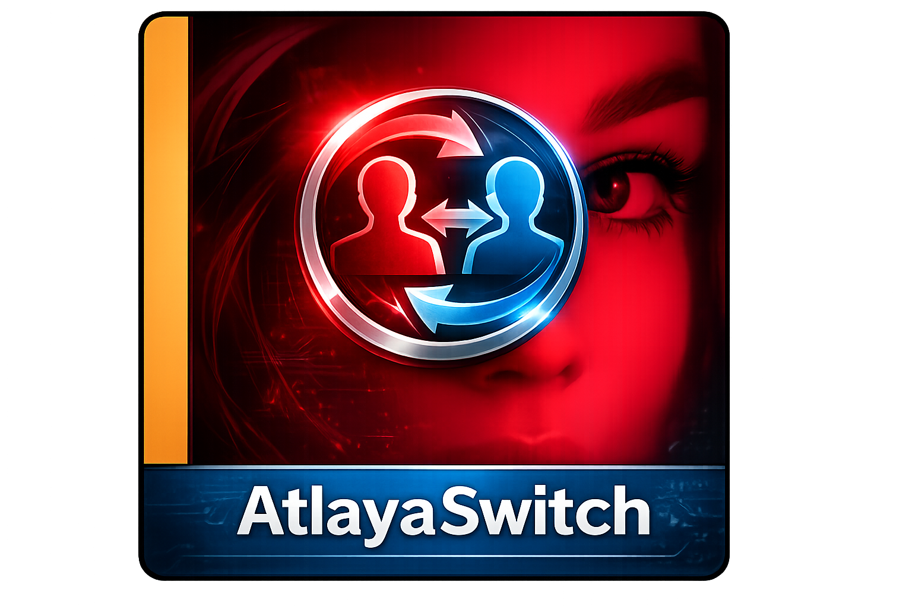

<p align="center">
  
</p>

# AtlayaSwitch

One tap on the app icon, and your phone shows only what it's supposed to show.

AtlayaSwitch is a lightweight, root-free Android app for GrapheneOS that switches instantly and without any visible menu to a predefined, deliberately unremarkable user profile — with a single tap on the app icon — for moments when a device might be briefly inspected or checked, without the action itself looking suspicious.

**Benefits:**
- No root required — uses [Shizuku's](https://shizuku.rikka.app/) ADB shell privileges. **This is a real trade-off, not free:** it needs Developer options and USB debugging switched on, and Wireless debugging briefly after every reboot — see "Known trade-offs" below
- No visible picker menu, no spoken codeword — switches in under a second
- The way back stays the regular, password-protected GrapheneOS profile switch — AtlayaSwitch doesn't touch it
- Automatically detects if it's accidentally installed in the decoy profile itself (which would give the trick away) and offers one-tap removal
- Fully offline, no cloud, no trackers

## Concept: a graduated response

AtlayaSwitch is the **first stage** of a graduated response for moments when someone wants to see your unlocked phone — a check, coercion, theft. One tap on the app icon, and the device instantly switches, with no visible menu, to a decoy profile (e.g. "Away"). Anyone looking at the device afterwards sees an everyday, unremarkable profile — and initially nothing that points to further profiles.

The core idea is **a reaction that matches the situation**: you don't have to take the most drastic step immediately. You can show only the decoy profile first. Only if you yourself decide the situation calls for it do you go one step further:

1. **Normal state:** you're using "Personal" or "Owner", the device is locked.
2. **Show the decoy profile:** you're asked to unlock or show the device. One tap — the decoy profile appears. Often that's enough on its own.
3. **Duress PIN as a last resort — only if you decide to:** if someone realises there are further profiles and demands access, you can give them GrapheneOS' own **duress PIN** as a supposed unlock code. If entered, GrapheneOS destroys the encryption — the data becomes permanently unreadable, and you're protected because no one can get to it anymore.

**Important:** AtlayaSwitch neither triggers the duress PIN nor replaces it. It's GrapheneOS' own feature, which you set up yourself (availability and details depend on your GrapheneOS version — see GrapheneOS' own documentation). Whether and when to escalate is entirely your call, there's no automatism. Also keep in mind: the destruction is **final** — keep backups of your data somewhere safe and separate, and consider the legal situation in your jurisdiction (this isn't legal advice).

## How it works

- **MainActivity** immediately performs the switch to the saved target profile on launch (no visible UI) and then closes itself.
- **QuickSwitchTileService** (optional, off by default, since v1.9.0) offers the same switch as a Quick Settings tile — reachable from the lock screen without opening the app. See "Quick Settings tile" below.
- **SettingsActivity** lists all existing GrapheneOS profiles and saves the selection as the target user ID. Reachable via System Settings -> Apps -> AtlayaSwitch -> App info (a "Settings" link appears there automatically, see section below) instead of a menu of its own.
- Since `Shizuku.newProcess()` is no longer publicly accessible in current Shizuku versions, the actual execution of `pm list users` / `am switch-user <id>` runs in a `UserService` process started via `Shizuku.bindUserService` with shell privileges (UID 2000). The app itself stays unprivileged, without `sharedUserId` and without root.

## Setup

1. **Install & enable Shizuku**
   - Since v1.6, **SettingsActivity** walks you through this step itself (see "Guided Shizuku setup" below) — doing it manually works the same way:
   - Install Shizuku from the Play Store / F-Droid.
   - **Important:** Developer options and "Wireless debugging" are only visible in the "Owner" profile on GrapheneOS (as on Android in general). Start Shizuku there first: enable developer options (Settings → About phone → tap the build number repeatedly if not visible yet), turn on **"USB debugging"** (no cable or PC needed — it just has to be on, see below) and "Wireless debugging", then tap "Start via Wireless debugging" in Shizuku (one-time pairing via pairing code, afterwards "Start" is enough). Runs entirely on the device itself, **no PC/ADB terminal needed** — the pairing code is entered directly on Shizuku's own screen. In secondary profiles ("Personal", "Away") Shizuku shows no start option there, that's not a bug.
   - **Then Wireless debugging is no longer needed and can go off** — AtlayaSwitch switches it off by itself as soon as Shizuku is running (Settings → "Wireless debugging", on by default, can be disabled). **USB debugging has to stay on:** Android keeps its debugging service (`adbd`) alive only while USB *or* Wireless debugging is on, and Shizuku is ended together with `adbd` (measured on a Pixel 10 Pro / GrapheneOS: Shizuku survived Wireless debugging being switched off, but was gone after USB debugging was switched off as well). If USB debugging is off, AtlayaSwitch deliberately does not switch Wireless debugging off and tells you why.
   - Alternatively, start it from a PC via USB ADB, without Wireless debugging at all: `adb shell <path>/libshizuku.so` — the exact command is shown in the Shizuku app under "View command". The Shizuku app's `start.sh` isn't always present, use the command shown there.
   - After starting, the service keeps running system-wide with ADB shell privileges and is automatically recognized by AtlayaSwitch/Shizuku in the other profiles. **Without root this doesn't survive a device reboot** — Shizuku has to be started again in the "Owner" profile after every reboot (GrapheneOS' auto-reboot counts too), otherwise AtlayaSwitch can't do the switch itself. In that case, tapping the icon quietly opens Android's own user switcher instead (no error message, nothing revealing on screen) — you can still tap your way into the target profile.

2. **Install AtlayaSwitch**
   - Download the current, signed **`app-release.apk`** from the [Releases page](../../releases/latest) and install it.

3. **Pick a target profile on first launch**
   - Open the app (or start `SettingsActivity` directly if no target profile is set yet).
   - Confirm the Shizuku permission when asked.
   - Tap the desired profile (e.g. "Away") -> toast "Target profile saved".

4. **From then on: app icon = one-tap switch**
   - Tapping the AtlayaSwitch icon now switches straight to the saved target profile with no further prompt.

## Quick Settings tile (optional, since v1.9.0)

A second, optional trigger alongside the app icon tap: a tile in the Quick Settings panel that performs the same switch — reachable straight from the lock screen, without unlocking or opening the app.

An earlier NFC-ring trigger was built and removed again in v1.8.2 (too many real-world issues: it never worked on a locked screen, a stale NFC dispatch cache after profile switches, per-profile tag-app permission grants). A true system-wide "tap anywhere" replacement was considered and rejected too: an overlay can't receive touches on the secured lock screen (same limitation NFC hit), and an accessibility service would need to enable touch-exploration mode, turning the whole device into a screen-reader-style UI — not an acceptable trade-off. The Quick Settings tile is the one mechanism that reaches the lock screen without either problem.

Because a tile is, unlike the icon tap, visible in the pulled-down panel, it's **off by default** and deliberately unassuming: generic label ("Profile"), plain neutral icon, no toast on tap.

To use it: enable "Enable tile" in Settings, then add the tile to the panel yourself via the pencil/edit icon in Quick Settings.

## What belongs in the decoy profile

The decoy profile is the only thing a third party ever gets to see. It should be **believable but unremarkable** — the way the phone of someone with nothing to hide would look. A completely empty profile looks suspicious and raises more questions than it answers.

**Put in:**
- a few harmless everyday photos and a small, unremarkable contact list
- everyday apps unrelated to your real accounts: camera, maps (prefer FOSS options like OrganicMaps or OsmAnd — no Google services, GrapheneOS is deliberately de-googled), weather, notes with mundane content, music/podcasts, a browser with some neutral history and bookmarks
- settings consistent with a normally used device (wallpaper, ringtone, a few calendar entries)

**Don't put in:**
- real accounts, logins or chats tied to your main identity; password managers, authenticators, banking apps
- real private photos, documents or contacts that could endanger you or others
- AtlayaSwitch or Shizuku themselves — they would give away the hidden switching mechanism (the app warns about this and offers one-tap removal from the target profile, see below)
- anything hinting at further profiles: notes, shortcuts, names, a note with the duress PIN written down
- sync or backups shared with your real profile

**No lock on the decoy profile:** for the switch to stay a genuine single tap with no further prompt, the decoy/duress profile should have **no PIN, password or fingerprint lock** set — any lock screen there would just present its own unlock prompt after the switch. Leaving it unlocked keeps the one-tap promise, but it's a trade-off: anyone who reaches that profile has unrestricted access to whatever is in it, with no second gate at all — so nothing should be there that isn't fine for anyone to see.

**What someone sees there:** initially just the decoy profile's content, nothing about your other profiles. Closer inspection can reveal more: Android's own user-switcher UI can list further profiles, and device-wide settings like saved Wi-Fi networks or paired Bluetooth devices can show revealing names across profiles. Check what's reachable from inside the decoy profile.

## Known trade-offs (please read)

- **ADB is part of the design.** Shizuku can only be started through Android's debugging service (`adbd`); without root there is no other way to get a process with shell rights. So Developer options and USB debugging stay on, and Wireless debugging is on briefly after each reboot. That is more attack surface than a phone without it, and it's the reason this app isn't for everyone — especially not for users who chose GrapheneOS to minimise exactly that.
- **What limits the exposure:** Wireless debugging goes off again automatically (see Setup), so no debugging port is left open on the network after the start. `adbd` over USB additionally needs a cable, an unlocked device and an authorised key (GrapheneOS' USB-C port setting is a further gate). Only apps you explicitly grant in Shizuku can use its shell rights — check that AtlayaSwitch is the only one. The `UserService` that runs with shell rights only accepts the fixed commands it needs and only acts on AtlayaSwitch's own package.
- **Can a stranger's computer just connect over ADB? Not without more.** USB debugging requires a cable *and* a computer confirmed on the device itself (an RSA-key confirmation dialog appears on screen — no tap, no connection). Wireless debugging additionally requires either the same one-time pairing code (shown on the phone, entered on the other device) or an already-authorised key on the same network. A stranger on the same Wi-Fi can't just get in through that.
- **The real risk isn't a stranger, it's an already-authorised computer.** Once a computer is confirmed with "always allow", its key becomes a standing master key: every future connection from it goes through without any further on-device confirmation, even on a locked screen (as long as the profile has been unlocked at least once since the last reboot). A compromised computer of your own — or a leaked `adbkey` file — is therefore a standing, PIN-free way in. Mitigations: only ever authorise your own, secured computer; "Revoke USB debugging authorisations" in Developer options revokes all trusted keys at once if you're ever unsure; GrapheneOS' own **Auto reboot** feature (Settings → Security) returns the device to the "Before First Unlock" state after some hours of inactivity, at which point not even an authorised computer can get in without the real PIN; "Switch + end session" mode reinforces this further, since an ended profile stays encrypted at rest until it's unlocked again — including against ADB.
- **It's not a lock.** The target profile can be recognised as "not the main profile". It only helps if it's plausibly filled with everyday content (a few photos, some apps, a bit of history) — an empty profile looks suspicious and raises more questions than it answers.
- **Shizuku dies with every reboot**, see Setup. Until you've started it again, the icon tap can't switch by itself (it opens Android's user switcher as a quiet fallback).
- **Any app in the same profile can start the switch** (the launcher activity has to be exported). With "Switch + end session" this also ends the source profile. The worst case is landing in the unremarkable target profile — no security risk, but an annoyance.
- **Network access:** the only thing AtlayaSwitch does online is the optional update check against `atlaya.capecter.com`; it only ever opens https links on that domain.

## Note on the way back

AtlayaSwitch only switches *to* the one designated profile. The way back to other profiles (including the password prompt) still runs via the normal GrapheneOS user switch: long-press the power button -> switch user.

## CRITICAL: AtlayaSwitch must never be installed in the target profile itself

The target profile is the deliberately unremarkable decoy profile that third parties (e.g. during a check) are also meant to see. **Having AtlayaSwitch installed there would itself reveal that a hidden switching mechanism (and therefore probably further, hidden profiles) exists** — regardless of whether the app is visibly shown in the menu there or not. AtlayaSwitch is therefore deliberately meant to run only in the "Owner" (User 0) and "Personal" profiles, never in the target profile (e.g. "Away").

`adb install` without a `--user` flag installs to **all** profiles by default — so every redeploy via `adb install -r app-release.apk` also lands the app in the target profile unless it's specifically removed afterwards.

**Since v1.7, AtlayaSwitch detects and prevents this itself:** whenever a target profile is selected in **SettingsActivity**, the app automatically checks (via the privileged Shizuku UserService) whether it's installed in the chosen target profile. If so, a clearly red warning appears right under the profile list with a "Remove from target profile now" button — removes AtlayaSwitch from exactly that profile with one tap, without needing to switch there (`pm uninstall --user <id>` via the UserService). That's the recommended approach after every redeploy: just briefly open **SettingsActivity** and dismiss the warning if present.

Still possible for manual deploys:

```
adb shell pm list users
adb shell pm uninstall --user <target profile ID> com.capecter.atlayaswitch
```

Or install specifically from the start:

```
adb install --user 0  app-release.apk   # Owner
adb install --user 10 app-release.apk   # Personal (check ID via "pm list users" if needed)
```

Shizuku itself has to be started once per device boot (in the "Owner" profile, since only there is the debugging setting visible). The service then keeps running system-wide with shell privileges and is automatically recognized by the Shizuku app instances in other profiles as soon as a permission request (e.g. by AtlayaSwitch) runs there once.

## Reaching settings via App info

AtlayaSwitch deliberately has no menu of its own that stands out via the app icon or the app overview. All settings (target profile) live in **SettingsActivity**, reachable via:

Android Settings -> Apps -> AtlayaSwitch -> App info -> "Settings" (appears there automatically because `SettingsActivity` declares the `android.intent.action.APPLICATION_PREFERENCES` intent).

Alternatively, start it directly: `adb shell am start -n com.capecter.atlayaswitch/.SettingsActivity`.

Target profile selection saves immediately on tap (SharedPreferences). A "Back" button at the bottom of the page returns to where you came from.

## Guided Shizuku setup (v1.6)

If Shizuku isn't running, **SettingsActivity** shows a banner at the top instead of just an error message — four states, because "not installed at all" and "installed but not running (e.g. after a reboot)" need different next steps, each further split by profile (developer options/wireless debugging are only visible in the "Owner" profile):

| Installed? | Profile | Shown |
|---|---|---|
| No | Owner | Button "Install Shizuku (Play Store)" — opens the app's detail page directly (`market://details?id=moe.shizuku.privileged.api`, falls back to the Play Store link in the browser if no Play Store is installed) |
| No | Personal/Away | Button "Switch profile" — opens Android's own multi-user overview (`android.settings.USER_SETTINGS`), tap "Owner" from there |
| Yes | Owner | Button "Open Shizuku" — jumps directly into the Shizuku app; automatically re-checks after returning |
| Yes | Personal/Away | Button "Switch profile" (as above) |

**What still isn't possible this way** (Android's security model, can't be bypassed without root): switching to the "Owner" profile itself always needs a manual tap there in the multi-user overview (a third-party app can't trigger a profile switch on its own before Shizuku exists — Shizuku is exactly what provides those rights, a classic chicken-and-egg problem), and the app installation itself always needs the final confirmation in the system install dialog (Android enforces this for every app install without device-owner rights). Both reduce to a single tap instead of requiring insider knowledge, but can't be fully automated away.

The pairing-code coupling itself has always run entirely on the device (Shizuku's own "Start via Wireless debugging" screen), **no PC/ADB terminal needed** — that was only a debugging method during development, not a step real users need. In the "installed but not running" state the banner therefore also offers an "Open Developer options" button (Owner profile only), so the after-reboot restart (USB debugging on, Wireless debugging on, "Start" in Shizuku) is a few taps without a PC.

## Update check

In **SettingsActivity** under "Updates": the "Check now" button reads `https://atlaya.capecter.com/atlayaswitch/updates/latest.json` and compares the version listed there with the installed one. The "Check automatically on open" toggle (default: off) does this automatically when opening Settings. If an update is available, a "Download" button appears that opens the download page in the browser — AtlayaSwitch doesn't download or install anything itself, and it only accepts https links on `atlaya.capecter.com`. There is no background check.

## Wireless ADB connection

`tools/connect-pixel.ps1 -IpPort <IP:Port>` connects Windows to the Pixel over wireless ADB. The IP:Port changes every time "Wireless debugging" is restarted or the IP changes on the network (shown on the Pixel under Developer options -> Wireless debugging, "Owner" profile). Automatic mDNS discovery without manual IP entry doesn't work reliably on this device, because GrapheneOS doesn't send the required discovery broadcasts persistently. A fixed DHCP reservation for the Pixel on the router helps get a more stable IP.

## Build from source

Debug (for development/testing):

```
./gradlew assembleDebug
```

Result: `app/build/outputs/apk/debug/app-debug.apk`

Release (signed, this is the version distributed on the Releases page):

```
./gradlew assembleRelease
```

Result: `app/build/outputs/apk/release/app-release.apk`. Requires your own signing key (`keystore.properties`, see `app/build.gradle.kts` — deliberately not part of this repo).

Requirements: JDK 17, Android SDK with Platform 34 / Build-Tools 34.0.0.

## Feedback welcome

I'd love to hear feedback, questions, ideas and bug reports — via [Issues](../../issues) or [Discussions](../../discussions). Reports from other GrapheneOS devices/versions you've tested it on are welcome too.

## License

This project is licensed under the **Atlaya Source-Available License (ASAL) v1.0**.
See [LICENSE](LICENSE) for the full text.

In short: you may download, install, and run AtlayaSwitch for your own
personal, non-commercial use. Modifying, redistributing, or using it
commercially requires prior written permission. Versions released up to and
including v1.7 remain available under the MIT License they were originally
published under; this does not extend to later versions.
